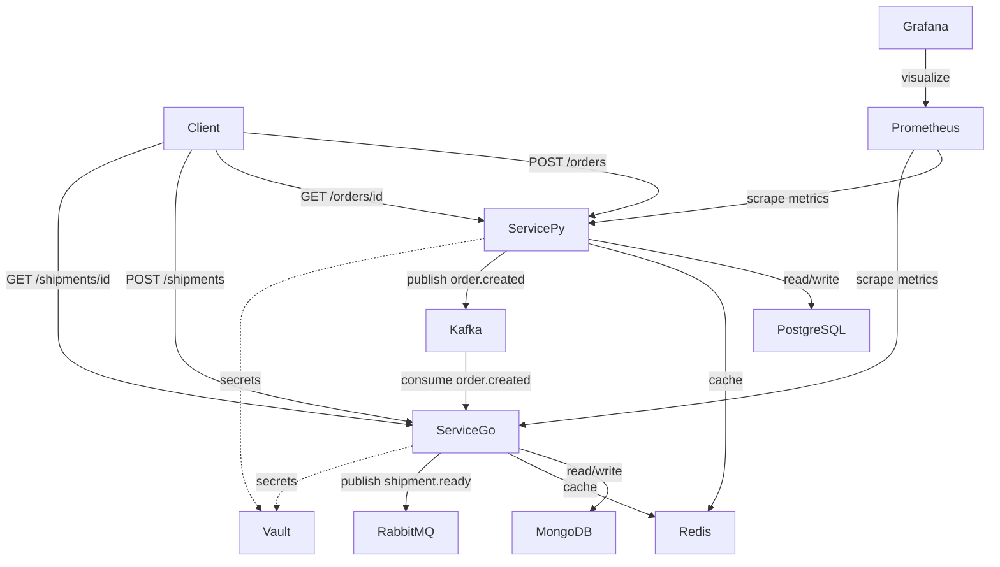

# Architecture

## Overview

Проект состоит из двух микросервисов которые обрабатывают заказы и отгрузки.

## Components

## Services

**Service-Py** (Python/Flask) — управление заказами
- `POST /orders` — создать заказ
- `GET /orders/{id}` — получить заказ
- База данных: PostgreSQL
- Кэш: Redis (60 сек)
- Отправляет событие `order.created` в Kafka

**Service-Go** (Go/Gin) — управление отгрузками
- `POST /shipments` — создать отгрузку
- `GET /shipments/{order_id}` — получить отгрузку
- База данных: MongoDB
- Кэш: Redis (30 сек)
- Читает `order.created` из Kafka
- Отправляет `shipment.ready` в RabbitMQ

## Infrastructure

| Компонент | Назначение | Namespace |
|-----------|-----------|-----------|
| PostgreSQL | База данных заказов | infra |
| MongoDB | База данных отгрузок | infra |
| Redis | Кэш для обоих сервисов | infra |
| Kafka | Очередь событий | infra |
| RabbitMQ | Брокер сообщений | infra |
| Vault | Управление секретами | vault |
| Prometheus | Сбор метрик | monitoring |
| Grafana | Визуализация метрик | monitoring |
| FluxCD | GitOps деплой | flux-system |
